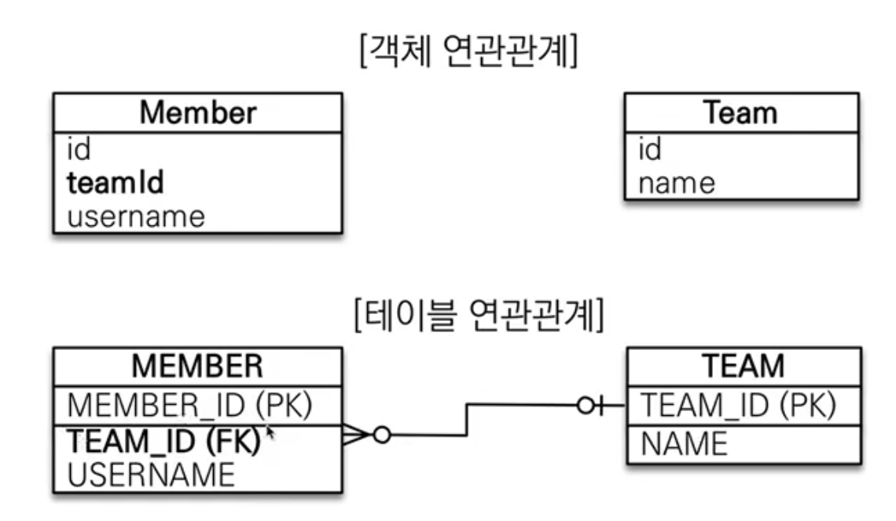

# 2주차 4 연관관계 매핑

좀더 객체 지향적인 설계가 어떻게 되는지 알아보자. 아주 어려우니 집중하자

# 용어이해

방향 : 단방향, 양방향

다중성 : 다대일, 일대다, 일대일, 다대다 이해

연관관계의 주인 : 객체 양방향 연관관계는 관리 주인이 필요

# 객체지향 설계의 목표는 자율적인 객체들의 협력 공동체를 만드는 것이다.

## 예상시나리오

회원과 팀이 있다.

회원은 하나의 팀에만 소속될 수 있다.

회원과 팀은 다대일 관계다.



멤버와 팀을 동시에 등록하고 싶은경우 팀을 만들고 persist를 통해 id를 받고 이를 다시 가져와서 멤버 객체에 넣고 persist를 해야한다. 상당히 귀찮고 객체지향스럽지 않다.

```java
Team team = new Team();
team.setName("TeamA");
em.persist(team);

Member member = new Member();
member.setUesrname("member1");
member.setTeamId(team.getId()); // 요게 상당히 애매하다. 외래키 식별자를 직접 다루는 상황
em.persist(member)

// 조회하는 경우도 상당히 불편해진다.
Member member = em.find(Member.class, member.getId());
Long findTeamId = findMember.getTeamId();
Team findTeam = em.find(Team.class, findTeamId());
```

### 결론적으로 테이블에 맞추어 데이터 중심으로 모델링하면, 협력관계를 만들 수 없다.

객체의 경우는 참조를 사용해서 연관된 객체를 찾는데 데이터베이스는 다르게 동작하는게 문제다.

# 단방향 연관관계


```java
public class Member{

	@ManyToOne // Member가 N이고 Team은 1이기 때문에 Many To One으로 설정한다.
	@JoinColumn(name="TEAM_ID") // 조인해야하는 컬럼이 무엇인지 명시한다.
	private Team team;
}
```


객체와 테이블의 연관관계를 joinColumn을 통해 명시해 준다. 즉 어떤 외래키와 매핑해서 데이터를 가져올건지 정의하는 것이다.

(\*외래키를 가지고 있는 객체가 연관관계의 주인이 된다.)

```java
// 저장
Team team = new Team();
team.setName("TeamA");
em.persist(team);

Member member = new Member();
member.setUesrname("member1");
member.setTeamId(team); // 요게 상당히 애매하다. 외래키 식별자를 직접 다루는 상황
em.persist(member)

// 조회하는 경우 관계된 Team을 바로 확인가능하다.
Member member = em.find(Member.class, member.getId());
Team team1 = findMember.getTeam();
//Team findTeam = em.find(Team.class, findTeamId());

// 수정하는 경우
Team getTeam = em.find(Team.class, 100L);
savedMember.setTeam(getTeam);
```

# 실습

```java
// 멤버 만들기
Member member = new Member();
member.setName("김재환");
member.setCity("서울");
em.persist(member);

// 주문 하기
Order order = new Order();
order.setMember(member);
em.persist(order);

Member savecMember = order.getMember();
System.out.println(savecMember.getName().toString()); d q qq
```


# 양방향 연관관계와 연관관계의 주인 1 - 기본


테이블의 연관관계는 양쪽으로 다 알 수 있다. 그런데 객체는 Team에서 Member로 갈수가 없었다. 그런데 List Members를 통해서 Member를 다 가져올 수 있는 것이다. 이게 바로 객체참조와 외래키 참조의 가장 큰 차이점이다.

객체는 단방향이 좋긴하다.

## MappedBy

meppedBuy =JPA의 멘탈붕괴 난이도

mappedBy는 처음에 이해하기 어렵다.

객체와 테이블간에 연관관계를 맺는 차이를 알아야 한다.

객체 참조

회원 → 팀 연관관계 1개(단방향)

팀 → 회원 연관관계 1개(단방향)

⇒ 단방향이 2개가 연관되어 있다고 생각하면 된다. 즉, 서로 다른 단방향 연관관계 2개를 양방향이라 부르는것뿐

따라서 A→B(a.getB()) , B→A(b.getA()) 로 두개를 사용하게 된다.

테이블 참조

회원 ↔ 팀 연관관계 1개(양방향) (사실상 방향이 없는거, 서로 오고갈 수 있기 때문이다.)

⇒ 외래키 하나로 서로를 참조가능하다. 양쪽 조인이 가능하다.


그런데 객체 참조는 둘다 외래키를 어디에 맵핑해야하는지 헷갈리게 된다. 두개중 하나를 선택하여 연관관계 주인만이 관리를 해야한다. **따라서 외래키가 있는 곳(N:1중 N)을 주인으로 정하는게 좋다(김영한님 뇌피셜) ⇒ 가끔 N:1중에 1을 주인으로 하는 경우 Team을 바꿨는데 다른 테이블에 업데이트 쿼리가 날아가는 경우가 생긴다. 즉, Team을 바꿨는데 쿼리가 Member update가 나가니까 헷갈리게 된다.**

주인은 MappedBy속성을 사용하면 안된다. 왜냐면 내가 맵핑이 되어진것이기 때문에 종속된 이야기라고 하기 때문에 Member로 주인을 설정해야한다.

**따라서 주인이 아니면 조회만 가능하고 수정은 불가능하다. 업데이트 하고 싶다면 주인을 사용해야한다.**

# 양방향 연관관계와 연관관계의 주인 2 - 주의점

## **양방향 매핑시 가장 많이 하는 실수**

```java
Team team = new Team();
team.setName("TeamA");
em.persist(team);

Member member = new Member();
member.setName("member1");

//역방향(주인이 아닌 방향)만 연관관계 설정 team.getMembers().add(member);
em.persist(member);
```

주인은 외래키를 가지고 있기 때문에 주인이 먼저 선언되어 persist되면 없는 값을 참조하게 되고 null값이 외래키로 들어가게 된다. 따라서 주인은 나중에 선언하여 삽입하는 방식으로 진행되어야 한다.

## **양방향 매핑시 연관관계의 주인에 값을 입력해야 한다.**

```java
Team team = new Team();
team.setName("TeamA");
em.persist(team);

Member member = new Member();
member.setName("member1");

team.getMembers().add(member); //연관관계의 주인에 값 설정
member.setTeam(team); //**
em.persist(member);
```

만약 em.flush() em.clear()를 해주지 않아서 1차 캐시에만 있는 것을 들고오게 되면 한쪽만 참조를 넣어주는 경우 데이터가 잡히지 않는다. 왜냐하면 1차 캐시에만 있는 경우 DB에 적절히 데이터가 들어가 있지 않은 경우에 불안정한 1차 캐시를 참조해서 들고오기 때문이다. 1차 캐시는 순수한 객체 상태이기 때문이다.

**⇒ 따라서 양방향 연관관계에서 값을 세팅하는 경우 객체 지향적으로 생각하면 양쪽 모두에 객체를 넣어주는게 옳다.**

### 연관관계 편의 메소드를 생성하자

getter/setter가 아니라 새로운 편의 메소드를 생성하여 사용가능하다.(null 체크, 중복검사 등등 다양한 체크 로직이 들어 갈 수는 있지만 깊이있게 사용하지는 않는다.)

```java
public class Member{
	public void changeTeam(Team team){
		this.team = team;
		team.getMembers().add(this); // 내부에서 세팅을 해준다.
	}
}
```

연관관계 편의 메소드가 양쪽에 있으면 문제가 발생할 수 있다. 따라서 언제 어디서 편의 메소드를 사용할지 정해주면 된다.

### 양방향 매핑시에 무한 루프를 조심하자

toString의 경우 양쪽에서 toString을 무한호출하게 된다. lombok 을 사용하는 경우 둘다 자동으로 생성하기 때문에 조심해야한다. JSON생성 라이브러리 사용하는 경우 Team을 JSON으로 바꾸고 Member안에 Team을 바꾸다 보면 계속 문제 발생한다.

**⇒ lombok에서 toString 안쓰면 됨. JSON 생성 라이브러리의 경우 controller에는 엔티티를 반환하지 말자. 엔티티는 DTO로 변환해서 반환하자. 그럼 문제 발생사라진다.**

## 양방향 매핑 정리

- 단방향 매핑만으로도 이미 연관관계 매핑을 끝낸다. 테이블관계에서 외래키가 나온다. 따라서 단방향 먼저 맵핑을 진행한다.
- 양방향 매핑은 반대방향으로 조회기능이 추가된 것뿐이다. 따라서 단방향 맵핑을 먼저 끝내야 한다.
- JPQL에서 역방향으로 탐색할 일이 많다.
- 단방향 매핑을 잘하고 양방향은 필요할 때 추가해도 된다.
- 비지니스 로직을 기준으로 연관관계주인을 선택하면 안된다. 연관관계 주인은 외래키의 위치를 기준으로 정한다.

# 실전예제 - 연관관계 매핑 시작


우선은 단방향 연관관계를 매핑하는게 제일 중요하다. 따라서 테이블 구조 만으로 단방향 매핑먼저 하자.

### ORDERS 연관관계 매핑

1. orders로 간다.
2. Member 객체를 선언한다.
3. ORDERS입장에서 MEMBER는 N:1이므로 @ManyToOne 어노테이션을 붙이고 매핑은 @JoinColumn을 통해 MEMBER의 ID와 매핑한다.
4. 코드

   ```java
   public class Order {
       @Id @GeneratedValue
       @Column(name = "ORDER_ID")
       private Long id;

   // 관계형 디비에 맞춰한 설계, 테이블의 외래키를 그대로 가져옴 -> 객체 그래프 탐색이 불가능
   //    @Column(name = "MEMBER_ID")
   //    private Long memberId;

       @ManyToOne
       @JoinColumn(name = "MEMBER_ID")
       private Member member;
   ```

   **(가급적이면 단방향으로 설계하고 필요할때만 양방향을 넣는게 좋다.)**

### ORDER_ITEM 연관관계 매핑

1. ORDER_ITEM로 간다.
2. Order 객체를 선언한다.
3. ORDER_ITEM입장에서 Order는 N:1이므로 @ManyToOne 어노테이션을 붙이고 매핑은 @JoinColumn을 통해 Order의 ID와 매핑한다.
4. 코드

   ```java
   public class OrderItem {
       @Id @GeneratedValue
       @Column(name = "ORDER_ITEM_ID")
       private Long id;

       //@Column(name = "ORDER_ID")
       //private Long orderId;
       @ManyToOne
       @JoinColumn(name = "ORDER_ID")
       private Order order;

       //@Column(name = "ITEM_ID")
       //private Long ItemId;
       @ManyToOne
       @JoinColumn(name = "ITEM_ID")
       private Item item;
   ```

   **(가급적이면 단방향으로 설계하고 필요할때만 양방향을 넣는게 좋다.)**


### 양방향 연관관계 맵핑

비지니스 적으로 의미가 있다면 양방향 연관관계를 만들어 주면 된다.

한 회원이 어떤 주문을 했는지 가져오는것도 유의미하기 때문에 OneToMany를 추가하여 양방향 연관관계를 설정한다.(사실 잘 없는 경우임)

```java
public class Member {

    @Id @GeneratedValue(strategy = GenerationType.AUTO)
    @Column(name="MEMBER_ID")
    private Long id;

    @Column(length = 10)
    private String name;
    private String city;
    private String street;
    private String zipcode;

    @OneToMany(mappedBy = "member")
    private List<Order> orders = new ArrayList<>(); // 관례로 사용함. null point 방지
```

주문서에서 존재하는 항목이 어떤 아이템을 가지고 있는지 중요하므로 OneToMany를 추가하여 양방향 연관관계를 설정해준다.

```java
public class Order {
    @Id @GeneratedValue
    @Column(name = "ORDER_ID")
    private Long id;

    @ManyToOne
    @JoinColumn(name = "MEMBER_ID")
    private Member member;

    @OneToMany(mappedBy="order")
    private List<OrderItem> orderItems = new ArrayList<>();
```

`private List<Order> orders = new ArrayList<>(); // 관례로 사용함. null point 방지`

양방향 연관관계가 아니어도 어플리케이션 구현에 아무 문제가 없다. 다 개발가능하다. 그러나 양방향을 만드는 이유는 개발상 편의(조회 등등)때문에 만드는것이다. **결론적으로는 그냥 왠만하면 단방향 연관관계를 잘 설계하는게 훨씬 중요하다.**
